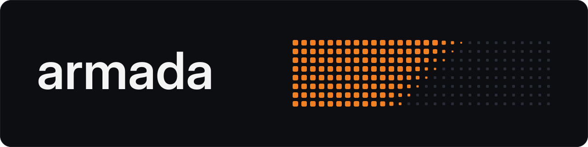
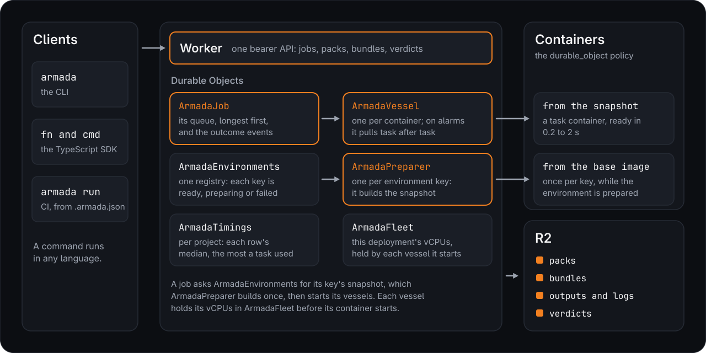
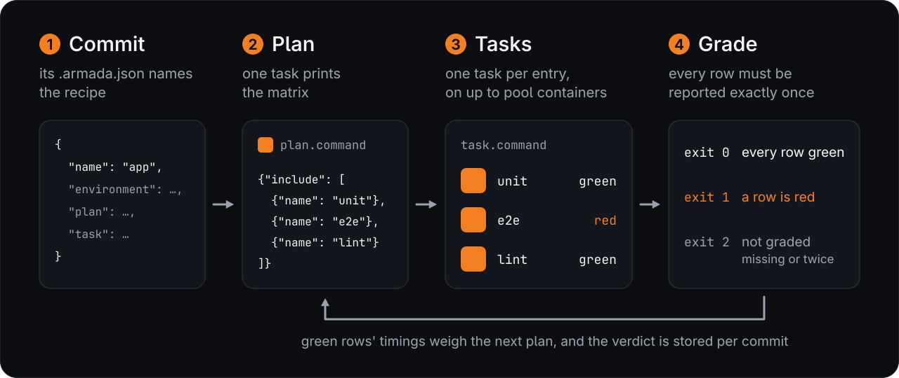

<p align="center"></p>

*An AI assistant maintains this README. It is presented as-is.*

armada runs a command, or a TypeScript or Python function, over many inputs at once on Cloudflare Containers in your own
account. I run Kinu's and Dew's CI on it.

- 100 videos re-encoded to 720p in 21 to 22 s on 100 containers, 1.3 to 1.4 times the slowest single encode. One
  container took 12 minutes for the same 100.
- A 90-row CI suite ran in 7 min 19 s on 13 containers. Its GitHub Actions matrix of 15 jobs took 13 min 2 s.
- One `true` task came back 2.5 s after it was sent.

## Install

```sh
curl -fsSL https://raw.githubusercontent.com/AshishKumar4/armada/main/install.sh | sh
armada deploy
armada map --times=3 --json -- echo hello {item}
```

The script installs [Bun](https://bun.sh) if it's missing and puts armada in `~/.armada`. `armada deploy` logs in to
Cloudflare in your browser, or uses `CLOUDFLARE_API_TOKEN`. Containers need the Workers Paid plan.

## How it works

<p align="center"></p>

armada is a Worker, a few Durable Objects and an R2 bucket in your account, so your code and data stay there.

1. armada prepares each environment once. It starts a container from the recipe's base image, runs `setup` as root
   and `install` as the user, and snapshots the result. The ffmpeg recipe's took 5.6 minutes. A changed recipe, or a
   changed file in `environment.key`, prepares a new one.
2. Containers start from the snapshot, in as little as 0.2 s, with a fresh tmpfs on `/tmp` and `/dev/shm`.
3. Each container pulls task after task from the job's one queue until it is empty, so no container waits behind
   another's slow task. Items with a higher `weight` start first.
4. Results stream back as they land. A small output rides in the result. A large one, and every log, goes to R2.

Each task runs as the user `ci`, in its own cgroup. armada stops anything a task leaves running before the next task
starts. Tasks that run one after another in a container share its `/tmp`, unless the job uses slots. A task the
platform loses runs again, up to three attempts. Each task gets exactly one recorded outcome, but a cut-off attempt
may already have done its work, so a task should be safe to run twice.

`lean/` holds machine-checked proofs of the scheduling rules. The `proofs` CI row builds them with warnings as errors.

- The list schedule that sizes a run's pool puts every task in exactly one lane. It meets Graham's bound: m times the
  makespan is at most the total work plus (m - 1) times the longest task.
- The fleet never holds more vCPUs than its cap.
- Every task of a finished job has exactly one outcome: its first accepted answer.

The proofs model the rules, not the Worker's code. A differential test checks the TypeScript `listSchedule` against
the Lean model on seeded instances.

## Measured

The video figures are from 2026-10-08, the others from one run each on 2026-10-07. Each row names its command, so
you can run it on your own deployment.

| Workload | armada | Comparison |
|---|---|---|
| 100 videos to 720p ([`examples/video-720p`](examples/video-720p)) | 21.1 s, 21.8 s and 22.3 s on 100 `small` containers (`bun bench.ts 100`) | 718.7 s in sequence on one `small` container, 7.2 s a video (`bun bench.ts 100 serial`) |
| A 90-row CI suite ([Kinu](https://github.com/AshishKumar4/kinu) at `0b74ff100`) | 7 min 19 s on 13 `medium` containers (`armada run 0b74ff100`) | 13 min 2 s on its GitHub Actions matrix of 15 jobs ([run 37672204809](https://github.com/AshishKumar4/kinu/actions/runs/37672204809)) |
| One task from a prepared snapshot | 2.5 s from sending it to its answer (`armada map --times=1 --size=micro -- true`) | |
| 100 three-second tasks | 9.1 s and 11.4 s on 100 `micro` containers (`armada map --times=100 --pool=100 --size=micro -- sleep 3`) | 300 s of work |
| 100 cached video answers | 5.6 s and 5.7 s, with no container started (`bun bench.ts 100 cached`) | 24.0 s and 28.3 s computing them |

Each video task makes a 10-second 1080p clip from ffmpeg's test sources, then re-encodes it to 720p H.264. Wall times
run from sending the items to downloading the last result. `bun bench.ts 100` prints where that time goes:

- Each video got its own container, so no run can end before its slowest encode. That is the bound.
- In the three runs above, the median encode took 7.7 to 7.9 s, but 15 to 22 of the 100 took 12 to 17 s on
  containers of the same size. The slowest took 16.1 to 17.3 s, so the runs took 1.3 to 1.4 times the bound.
- The last of the 100 containers answered 0.6 to 0.8 s after the job asked for it. The rest is launching each task,
  storing its output in R2 and downloading all 100.
- Two earlier runs that day were slower. The first 100-container run on the snapshot took 40.4 s: its containers
  answered from 0.2 s to 32.0 s after they were asked for (median 17.4 s). The next took 38.8 s, because one encode
  took 31.1 s.

Asked for 100 containers at once, armada had all 100 started within 3.7 s and 8.7 s in two runs of three-second tasks.
The CI suite ended 2 s after its longest row (442 s against 440 s), because its plan weighs each row by its measured
seconds.

## From the command line

```sh
# A flaky test, 20 times at once, in the commit's own environment
armada map --commit=HEAD --times=20 -- bun test tests/flaky.test.ts

# One task per line of urls.txt, each keeping the file it writes
armada map --items=urls.txt --output -- sh -c 'curl -sL {item} > {out}'
```

| Placeholder | Becomes |
|---|---|
| `{item}` | The item's text, or its JSON. An object item's scalar keys fill placeholders of the same name. |
| `{index}` | The item's position. |
| `{out}` | The file a task writes when `output` is set. |
| `{files}` | The directory with the job's small `files`. |
| `{artifacts}` | The directory whose files the task keeps, as a tar.gz at the task's `artifacts` route. |

An unknown placeholder is an error. An object item's numeric `weight` moves it up the queue. `map` exits 1 if a task
exits nonzero and 2 if a task could not run.

### Gangs

An object item's `gang` runs it on that many containers at once, for a program that spans hosts, such as a multi-host
JAX run. Each rank gets `ARMADA_RANK` and `ARMADA_WORLD`, and reaches rank `r` as host `rank<r>` (127.0.1.`r+1`) on
any port it listens on. jax.distributed's coordinator at `rank0:<port>` and gloo's collectives work over it unchanged.

```sh
echo '[{"gang": 2}]' | armada map --items=- -- sh -c 'python3 train.py --rank $ARMADA_RANK --coordinator rank0:8476'
```

The gang starts once every rank has a container. A rank lost to the platform loses the whole gang, which runs again
as one task. The task's outcome is its first failing rank's, else rank 0's.

Containers have no inbound address, so ranks connect through the Worker: about 5 ms a round trip and 40 to 90 MB/s a
connection, at 2 to 64 ranks. That suits tests and coordination, not bandwidth-bound training. A connection to a port
nothing listens on yet opens and then closes at once, so a client retries it as it would a refused one. The two ranks'
relays hold a connection's bytes. If its WebSocket drops, or the vessel between the ranks is reset or redeployed, the
connection carries on unseen when both ends come back within a minute.

## From TypeScript

This example reads each video's length and resolution, then re-encodes every video to 720p, each on its own container.

Add armada with `bun add github:AshishKumar4/armada`. `armada.config.ts` names the project and its tasks' folder:

```ts
// armada.config.ts
import { defineConfig } from 'armada';

export default defineConfig({ project: 'media', tasks: ['armada'] });
```

```ts
// armada/video.ts
import { recipe, sh, task } from 'armada';
import * as v from 'valibot';

export const media = recipe.debian().apt('ffmpeg').size('small');

// Re-encode one video to 720p H.264. sh passes ${url} and ${out} as single words, so nothing needs quoting.
export const transcode = task({
  id: 'transcode',
  recipe: media,
  output: 'bytes',
  run: (url: string, { out }) =>
    sh`ffmpeg -loglevel error -i ${url} -vf scale=-2:720 -c:v libx264 -preset veryfast -c:a aac -f mp4 ${out}`,
});

// Read a video's length and resolution with ffprobe. The output schema checks each answer when it lands.
export const probe = task({
  id: 'probe',
  recipe: media,
  output: v.object({ seconds: v.number(), width: v.number(), height: v.number() }),
  run: async (url: string) => {
    const info = JSON.parse(await sh`ffprobe -v error -select_streams v:0 -show_entries stream=width,height:format=duration -of json ${url}`.text());

    return { seconds: Number(info.format.duration), width: Number(info.streams[0].width), height: Number(info.streams[0].height) };
  },
});
```

```ts
// encode.ts
import { probe, transcode } from './armada/video';

const videos = (await Bun.file('videos.txt').text()).split('\n').filter(Boolean);

const infos = await probe.map(videos); // { seconds, width, height }[], in input order
console.log(`${videos.length} videos, ${Math.round(infos.reduce((sum, info) => sum + info.seconds, 0))} seconds in all`);

const started = Date.now();
const job = transcode.stream(videos);
let slowest = 0;

for await (const result of job) { // each file as soon as its container finishes
  slowest = Math.max(slowest, result.meta.seconds); // how long its encode ran on its container
  if (result.ok) await Bun.write(`720p/${String(result.index)}.mp4`, result.value);
  else console.error(`${result.item}: ${result.kind}`);
}
const { vessels } = await job.summary();
console.log(`encoded in ${((Date.now() - started) / 1000).toFixed(1)} s on ${vessels} containers; the slowest encode took ${slowest.toFixed(1)} s`);
```

With two 10-second 1080p test videos in `videos.txt`, `bun encode.ts` printed:

```
2 videos, 20 seconds in all
encoded in 9.1 s on 2 containers; the slowest encode took 6.4 s
```

It wrote two 1280x720 files. Each video had its own container, so the run could not end before its slowest encode,
6.4 s. The other 2.7 s went to starting both containers, launching each task, and storing and downloading both
outputs. A second run printed 9.7 s and 6.7 s.

- `.map` returns values in input order and throws a `MapError` if any item fails. `.stream` yields each result as it
  lands. `.run` runs one item on a container, and `.local` runs it on this machine.
- A failed result's `kind` is `error`, `timeout`, `cancelled` or `lost`. Every result's `meta` has its seconds, exit
  code, log tail, and peak memory and CPU.
- `armada push` uploads the project's tasks and drops the ones it no longer exports. A script in the project pushes on
  its first run, and `armada dev` pushes on every save.
- A recipe is `recipe.debian()` or `recipe.from(image)`, then `.apt()`, `.setup()`, `.install()` and `.size()`. Each
  container also loads the task's file, so a recipe that reads local files goes in a function, `recipe: () => ...`,
  which runs only on the machine that starts the job.
- `sh` passes each `${}` as one word. `` sh.raw`...` `` doesn't escape, for a script that is itself shell.
- A task's `output` checks each answer when it lands, and types it: a schema, `'text'` or `'bytes'`. Without one, a
  body's answer is JSON and a command's is `null`. An `input` schema checks each item before it's sent.
- Schemas can be valibot, zod or arktype (any [Standard Schema](https://standardschema.dev)). Items and answers are
  plain JSON, or bytes for an answer. A `Date`, a `Map`, `any` or `unknown` is a type error.
- An output can be up to 4.995 GiB, R2's limit for one upload, and `job.outputStream(i)` streams it. A 336 MB tarball
  built as one task came back as one output in 41 s, start to file.
- `map(items, { pool, slots, label, env, files, tmpfs })` sets a job's options.
- `slots` runs that many tasks at once in each container, each in its own mount namespace. A slot gets its own task
  directory, a fresh tmpfs, overlays over the checkout and `$HOME`, and a cgroup with an even share of the size's
  memory. The slots share the network, so two tasks cannot bind one fixed port, and a gang task cannot run in slots.
- A task takes a `timeout`. `speculative` lets an idle container rerun a straggler, and `hedge` runs that many of the
  heaviest items twice from the start. Either way the first answer is kept.
- `retries` reruns an item only for the failures you name. With `retries: { attempts: 3, backoffSeconds: 5,
  exitCodes: [75], errors: ['FetchError'] }`, an item that exits 75 or throws a `FetchError` runs up to three times,
  waiting 5 s, then 10 s. Any other failure is final.
- `secrets` gives a task values kept out of your code. `echo "$KEY" | armada secret set OPENAI_API_KEY` stores one, and
  a task with `secrets: ['OPENAI_API_KEY']` reads `context.secrets.OPENAI_API_KEY`. A command gets it in its
  environment. Reading a secret the task didn't name is a type error, and no call reads a value back. Each value of 4
  bytes or more shows as `***` in logs. `.local` reads secrets from your environment.
- `cache: { days: 7 }` keeps each green answer for a week, keyed by the task, the item, the recipe and the pushed task
  files. An item answered before comes back at once with `meta.cached`, and no container starts. Use it only for a
  task whose answer its item decides.

## From Python

The Python SDK runs the same tasks over the same wire as the TypeScript one, so a job's results read the same from
either side. Install it with `pip install "git+https://github.com/AshishKumar4/armada#subdirectory=python"`. A
`[tool.armada]` table in `pyproject.toml` names the project and its tasks' folder:

```toml
# pyproject.toml
[tool.armada]
project = "media"
tasks = ["tasks"]
```

```python
# tasks/video.py
from armada import Context, recipe, sh, task

@task(id="transcode", recipe=recipe.debian().apt("ffmpeg").size("small"), output="bytes")
def transcode(url: str, ctx: Context):
    # sh quotes each {} itself; ctx.out is the file the task answers with.
    return sh("ffmpeg -loglevel error -i {} -vf scale=-2:720 -c:v libx264 -preset veryfast -c:a aac -f mp4 {}", url, ctx.out)
```

`python -m armada push` bundles the tasks and records them. `transcode.map(urls)` returns the values in input order,
`transcode.stream(urls)` yields each result as it lands, `transcode.run(url)` runs one item, and `transcode.local(url)`
runs it on this machine. A body's return value is its answer, and `bytes` come back as `bytes`. An `output` model
or function checks each answer when it lands. [`examples/python-square`](examples/python-square) shows validators,
secrets, artifacts, retries and caching.

## CI with `armada run`

<p align="center"></p>

```sh
armada run HEAD
```

`armada run` uploads the commit from your machine, so private repos and unpushed commits work. It reads the commit's
`.armada.json`, runs the plan command, and runs one task per matrix entry. armada tests itself this way:

```json
{
  "name": "armada",
  "environment": {
    "setup": "ci/setup.sh",
    "install": "ci/install.sh",
    "key": ["bun.lock", "package.json"]
  },
  "pool": 8,
  "size": "auto",
  "plan": { "command": ["echo", "{\"include\": [{\"name\": \"test\"}, {\"name\": \"typecheck\"}, {\"name\": \"relay\", \"gang\": 8}, {\"name\": \"proofs\"}, {\"name\": \"python\"}, {\"name\": \"lint\"}]}"] },
  "task": { "command": ["bun", "run", "{name}"], "verdict": false, "timeout": 600 }
}
```

Words after `armada run HEAD --` go to the plan command, to run part of the matrix. `--secrets=A,B` gives one run's
tasks those secrets, for a narrowed run whose credentials the whole matrix must not see. Ctrl-C cancels the job.

A run of the whole matrix stores its verdict under the commit. `armada verdict <commit>` prints it and exits 0 when
every row is green, 1 when a row is red and 2 when the commit has none, so a hook or a deploy can reuse the proof.
Every run writes its report and prints `report: <path>`, including a run that cannot grade every row.

`armada run --json` prints the progress on stderr and ends with one JSON object on stdout:
`{sha, planJob, job, report, graded: "pass" | "fail" | "not graded", problems, rows}`. Its rows are the same objects
the report holds, and its exit code is the same as without `--json`.

A task can keep files beside its verdict. It writes them under `{artifacts}`, also `ARMADA_ARTIFACTS` in its
environment, and a row names the ones that are its evidence: `"artifacts": ["shots/home.png"]`. `armada run` extracts
each task's artifacts next to the report, in `~/.local/state/armada/runs/<project>-<job>/<task>/`, and prints each
named file under a red row. A row that names a file its task did not keep leaves the run ungraded. Artifacts are kept
as written: they may be binary, and the log's secret mask does not apply to them. `armada map --artifacts=<dir>`
extracts them the same way, under `<dir>/<index>`.

A matrix entry may name the `rows` its task must report. A task that reports other rows leaves the run ungraded.

| Field | Default | Meaning |
|---|---|---|
| `name` | | The project's slug. |
| `environment.base` | `cloudflare/debian-trixie` | The base image. Only Cloudflare-managed images start. |
| `environment.setup` | | A script in the commit, run as root once per environment. |
| `environment.install` | | A script in the commit, run as `ci` in the checkout once per environment. |
| `environment.key` | `[]` | Globs over the files whose content keys the environment, such as the lockfile. |
| `checkout` | `/home/ci/work/<name>/<name>` | Where the commit is checked out. |
| `history` | `full` | `commit` checks out the tree without its history. |
| `env` | `{}` | Environment variables for the plan and tasks. `{workdir}` is the checkout. |
| `tmpfs` | `["/tmp", "/dev/shm"]` | Paths that get a fresh tmpfs in each container. |
| `size` | `medium` | The container size, from the table below, or `auto`. |
| `pool` | `40` | The most containers the tasks run on. The plan's `weight`s or past timings can make it fewer. |
| `target` | `300` | Seconds per task the plan aims for, passed as `{target}`. |
| `plan.command` | | Prints `{"include": [...]}`. Gets `{target}`, and `{timings}`, a file of past timings. |
| `plan.local` | `false` | Runs the plan here, on a clean checkout of the commit, instead of in a container whose start can take a minute. |
| `task.command` | | Runs one matrix entry. The entry's keys fill its placeholders. |
| `task.name` | `name` | The entry key that names a task. |
| `task.verdict` | `true` | The task writes `{"rows": [{"name", "exitCode", "seconds", "output"}]}` to `{out}`. With `false`, its exit code is its one row. |
| `task.speculative` | `false` | Lets an idle container run a straggler again. |
| `task.slots` | `1` | The tasks one container runs at once, each in its own slot. |
| `task.hedge` | `0` | Runs this many of the plan's heaviest tasks twice from the start, the first answer kept, so a slow container holds the run up no longer than the other copy takes. |
| `task.timeout` | `3600` | A task's limit, in seconds. |
| `task.secrets` | `[]` | The secrets each task gets in its environment, by name (`armada secret set <name>`). |

| Size | vCPU | Memory | Cloudflare instance type |
|---|---|---|---|
| `micro` | 1/2 | 4 GiB | `standard-1` |
| `mini` | 1 | 6 GiB | `standard-2` |
| `small` | 2 | 8 GiB | `standard-3` |
| `medium` | 4 | 12 GiB | `standard-4` |

With `"size": "auto"`, each run takes the smallest size that the last five runs' tasks fill to three quarters at most,
in peak memory and average busy cores. A new size prepares its own environment once.

### CI on push, through a GitHub webhook

```sh
armada webhook add armada --repo=owner/name --pull-requests
```

This gives the project a webhook on the deployment. Each push to the repo's branches, and each pull request from the
same repository, starts that commit's whole `armada run` on the deployment itself. With no `--branches`, only the
default branch builds. The run stores its verdict as a local run does, and posts a GitHub commit status, such as
"88 of 90 rows green", that links to the dashboard's CI page.

`POST /webhooks/github/<project>` is the one route outside the deployment's bearer. GitHub's `X-Hub-Signature-256` is
its only check. A delivery or a commit seen before is skipped. A pull request from a fork never builds, because its
code must not get the deployment's secrets.

The run's driver is a task in a `small` container whose environment holds only Bun, so a redeploy prepares no new
environment. The driver fetches armada at the deployment's own commit, `ARMADA_SHA`, which `armada deploy` sets and
`/health` reports, so deploy from a pushed commit. It gets the GitHub token and the deployment's bearer when it
starts, and its log masks both like any secret.

`armada webhook add` creates or updates the GitHub hook through `gh` when you're signed in. Otherwise it prints the
settings to add by hand. `armada webhook list` and `armada webhook remove <project>` manage them.

## Dashboard

`armada dashboard` opens the deployment's dashboard in your browser, signed in, and the token never leaves the
browser. `armada dashboard --serve=<port>` serves it from your machine instead, which signs each request itself.

It shows the fleet and its recent jobs, each job's tasks and a timeline of its containers, and each task's item,
output, log and artifacts. It also lists the environments and each project's CI verdicts. A container that ran tasks
in more than one slot gets one timeline lane for each slot.

## Deploying

`armada deploy --name=<name>` deploys a second armada on the same account and prints the file that
`--connection=<file>` takes, to point any command at it. `--vcpus=N` caps that deployment's fleet.

A deploy over a running armada keeps its jobs running when the new Worker still serves every client the old one
does. Six deploys in two minutes, over 200 one-minute tasks, cut no task and refused no job. A deploy waits for the
open jobs first in four cases:

- with `--drain`;
- when the deployed version answers no health check;
- when the new Worker would refuse a client the old one serves;
- when the container driver changes.

That wait lapses after 10 minutes if the deploy dies.

An account's snapshots are limited, so the Worker deletes environment snapshots it no longer needs. It keeps the
snapshots of:

- every environment an open job uses;
- the 3 most recently used others;
- any environment used in the last hour.

It deletes the rest after it prepares each new environment, and it looks again each hour. A busy hour's environments
stay until that hour is quiet, and then the deployment keeps 3. A job's environment counts as used until the job ends.
`--keep=N` changes the count. Each deploy mints registry credentials through your wrangler login, valid for a year,
and gives them to the Worker as a secret. `armada prune` deletes now, from your machine, and `armada prune --keep=0`
keeps only what open jobs use.

A client and a Worker that speak versions of the wire too far apart refuse each other's requests, and say which one to
update.

## Commands

```
armada deploy [--account=<id>] [--name=<name>] [--vcpus=N] [--drain] [--keep=N]
armada map [--env=<recipe.json> | --commit=<rev>] (--times=N | --items=<file|->) [--size=<size>] [--pool=N] [--slots=N] [--timeout=S] [--output] [--artifacts=<dir>] [--speculative] [--hedge=N] [--secrets=<A,B>] [--json] -- <command>
armada run <commit|worktree> [--label=<text>] [--secrets=<A,B>] [--json] [-- <plan args>]
armada verdict <commit|worktree> [--json]
armada push
armada dev
armada status <job-id>
armada dashboard [--serve=<port>]
armada secret set <NAME> | list | delete <NAME>
armada webhook add <project> --repo=<owner/name> [--branches=a,b] [--pull-requests] [--token-secret=NAME]
armada webhook list
armada webhook remove <project>
armada prune [--keep=N]
```

`armada --help` describes every option.
