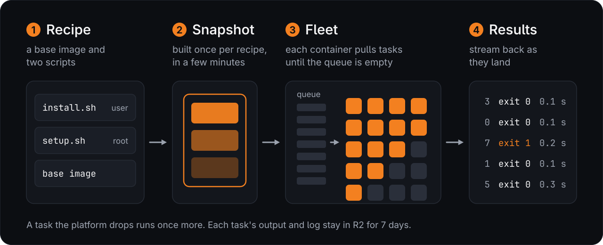

<p align="center"></p>

Run a command or a TypeScript function over many inputs at once, on Cloudflare Containers.

The CLI and `armada run` work with any language the environment installs. The typed SDK is TypeScript.

For example, you can use it for CI. It takes about 7 seconds to spawn 100 containers and run a 3-second command on
each, all in parallel.

## Install

```sh
curl -fsSL https://raw.githubusercontent.com/AshishKumar4/armada/main/install.sh | sh
armada deploy
armada map --times=3 --json -- echo hello {item}
```

The script installs [Bun](https://bun.sh) if it's missing and puts armada in `~/.armada`. `armada deploy` opens a
Cloudflare login in your browser (or uses `CLOUDFLARE_API_TOKEN`) and deploys armada to your account. Containers need
the Workers Paid plan.

## How a job runs

<p align="center"></p>

Each task runs as the user `ci`, in a cgroup of its own (`$ARMADA_CGROUP`), with fresh tmpfs on `/tmp` and `/dev/shm`.
Anything a task leaves running is stopped before the next task starts.

## Architecture

<p align="center"></p>

The CLI and the SDK call one Worker. Its Durable Objects hold the state: each job's queue, one object per container,
the fleet's vCPU count, and the prepared environments. Code, outputs, logs and verdicts go to R2.

### The preparer

Installing the tools in every container would cost minutes per container. So armada prepares each environment once:
it starts a container from the base image, runs the recipe's `setup` and `install` (checking out the commit first, for
CI), and snapshots it. Every container after that starts from the snapshot in 0.2 to 2 seconds. Changing the recipe,
or a file listed in `environment.key`, prepares a new snapshot.

## Examples

```sh
# A flaky test, 20 times at once, in the commit's own environment
armada map --commit=HEAD --times=20 -- bun test tests/flaky.test.ts

# One task per line of urls.txt, each keeping the file it writes
armada map --items=urls.txt --output -- sh -c 'curl -sL {item} > {out}'
```

| Placeholder | Becomes |
|---|---|
| `{item}` | The item's text, or its JSON. An object item's scalar keys fill placeholders of the same name. |
| `{index}` | The item's position. |
| `{out}` | The file a task writes when `output` is set. |
| `{files}` | The directory with the job's small `files`. |

The CLI and `.armada.json` fill these in a command's words; an unknown one is an error. An object item's numeric
`weight` moves it up the queue.

## From TypeScript

Re-encoding a folder of videos takes a long time on one machine. This example reads each video's length and
resolution, then re-encodes every video to 720p with ffmpeg, each on its own container, all at once.

Add armada with `bun add github:AshishKumar4/armada`. `armada.config.ts` names the project and the folder its tasks
live in:

```ts
// armada.config.ts
import { defineConfig } from 'armada';

export default defineConfig({ project: 'media', tasks: ['armada'] });
```

```ts
// armada/video.ts
import { recipe, sh, task } from 'armada';
import * as v from 'valibot';

export const media = recipe.debian().apt('ffmpeg').size('small');

// Re-encode one video to 720p H.264. sh passes ${url} and ${out} as single words, so nothing needs quoting.
export const transcode = task({
  id: 'transcode',
  recipe: media,
  output: 'bytes',
  run: (url: string, { out }) =>
    sh`ffmpeg -loglevel error -i ${url} -vf scale=-2:720 -c:v libx264 -preset veryfast -c:a aac -f mp4 ${out}`,
});

// Read a video's length and resolution with ffprobe. The schema checks the answer inside the container.
export const probe = task({
  id: 'probe',
  recipe: media,
  output: v.object({ seconds: v.number(), width: v.number(), height: v.number() }),
  run: async (url: string) => {
    const info = JSON.parse(await sh`ffprobe -v error -select_streams v:0 -show_entries stream=width,height:format=duration -of json ${url}`.text());

    return { seconds: Number(info.format.duration), width: Number(info.streams[0].width), height: Number(info.streams[0].height) };
  },
});
```

Any script in the project can then run them:

```ts
// encode.ts
import { probe, transcode } from './armada/video';

const videos = (await Bun.file('videos.txt').text()).split('\n').filter(Boolean);

const infos = await probe.map(videos); // { seconds, width, height }[], in input order
console.log(`${videos.length} videos, ${Math.round(infos.reduce((sum, info) => sum + info.seconds, 0))} seconds in all`);

for await (const result of transcode.stream(videos)) { // each file as soon as its container finishes
  if (result.ok) await Bun.write(`720p/${String(result.index)}.mp4`, result.value);
  else console.error(`${result.item}: ${result.kind}`);
}
```

`bun encode.ts` with two 10-second test videos in `videos.txt` printed `2 videos, 20 seconds in all` and wrote two
1280x720 files.

- `armada push` uploads the project's tasks, and drops the ones it no longer exports. A script inside the project
  pushes on its first run, and `armada dev` pushes on every save.
- `.map` returns the values in input order, and throws a `MapError` if any item fails. `.stream` hands back each
  result as it lands. `.run` runs one item on a container, and `.local` runs it on this machine.
- A failed result's `kind` says why: `error`, `timeout`, `cancelled` or `lost`. Every result's `meta` has its seconds,
  exit code, log tail, and peak memory and CPU.
- A recipe is built in steps: `recipe.debian()` or `recipe.from(image)`, then `.apt()`, `.setup()`, `.install()` and
  `.size()`. Each container also loads the task's file, so a recipe that reads local files goes in a function,
  `recipe: () => ...`, which runs only on the machine that starts the job.
- `sh` passes each `${}` as one word. `` sh.raw`...` `` doesn't escape, for a script that is itself shell.
- Schemas can be valibot, zod or arktype (any [Standard Schema](https://standardschema.dev)). Items are checked before
  they're sent, and values inside the container.
- Items and values are plain JSON, or bytes for a value. A `Date`, a `Map`, `any` or `unknown` is a type error.
- An output can be up to 4.995 GiB, R2's limit for one upload. `job.outputStream(i)` streams a large one.
- `map(items, { pool, label, env, files, tmpfs })` sets a job's options. A task takes `timeout`, and `speculative` to
  let an idle container rerun a straggler.
- `retries` runs a failed item again, only for the failures you name. With `retries: { attempts: 3, backoffSeconds: 5,
  exitCodes: [75], errors: ['FetchError'] }`, an item that exits 75 or throws a `FetchError` runs up to three times,
  waiting 5 s, then 10 s. Any other failure is final.

## CI with `armada run`

<p align="center"></p>

```sh
armada run HEAD
```

armada tests itself this way. Its `.armada.json`:

```json
{
  "name": "armada",
  "environment": {
    "setup": "ci/setup.sh",
    "install": "ci/install.sh",
    "key": ["bun.lock", "package.json"]
  },
  "pool": 2,
  "size": "auto",
  "plan": { "command": ["echo", "{\"include\": [{\"name\": \"test\"}, {\"name\": \"typecheck\"}]}"] },
  "task": { "command": ["bun", "run", "{name}"], "verdict": false, "timeout": 600 }
}
```

The commit is uploaded from your machine, so private repos and unpushed commits work. Words after
`armada run HEAD --` go to the plan command, to run part of the matrix. Ctrl-C cancels the job.

A run of the whole matrix stores its verdict under the commit. `armada verdict <commit>` prints it and exits 0 when
every row is green, 1 when a row is red and 2 when the commit has none, so a hook or a deploy can take a commit's
proof without running it again.

| Field | Default | Meaning |
|---|---|---|
| `name` | | The project's slug. |
| `environment.base` | `cloudflare/debian-trixie` | The base image. Only Cloudflare-managed images start. |
| `environment.setup` | | A script in the commit, run as root once per environment. |
| `environment.install` | | A script in the commit, run as `ci` in the checkout once per environment. |
| `environment.key` | `[]` | Globs over the files whose content keys the environment, such as the lockfile. |
| `checkout` | `/home/ci/work/<name>/<name>` | Where the commit is checked out. |
| `history` | `full` | `commit` checks out the tree without its history. |
| `env` | `{}` | Environment variables for the plan and tasks. `{workdir}` is the checkout. |
| `tmpfs` | `["/tmp", "/dev/shm"]` | Paths that get a fresh tmpfs in each container. |
| `size` | `medium` | The container size, from the table below, or `auto`. |
| `pool` | `40` | The most containers the tasks run on. The plan's `weight`s or past timings can make it fewer. |
| `target` | `300` | Seconds per task the plan aims for, passed as `{target}`. |
| `plan.command` | | Prints `{"include": [...]}`. Gets `{target}`, and `{timings}`, a file of past timings. |
| `task.command` | | Runs one matrix entry. The entry's keys fill its placeholders. |
| `task.name` | `name` | The entry key that names a task. |
| `task.verdict` | `true` | The task writes `{"rows": [{"name", "exitCode", "seconds", "output"}]}` to `{out}`. With `false`, its exit code is its one row. |
| `task.speculative` | `false` | Lets an idle container run a straggler again. |
| `task.timeout` | `3600` | A task's limit, in seconds. |

A matrix entry may list the `rows` its task must report.

| Size | vCPU | Memory | Cloudflare instance type |
|---|---|---|---|
| `micro` | 1/2 | 4 GiB | `standard-1` |
| `mini` | 1 | 6 GiB | `standard-2` |
| `small` | 2 | 8 GiB | `standard-3` |
| `medium` | 4 | 12 GiB | `standard-4` |

Cloudflare has no larger container. With `"size": "auto"`, each run takes the smallest size that the last five runs'
tasks fill to three quarters at most, in peak memory and in average busy cores. A new size prepares its own environment
once.

## Commands

```
armada deploy [--account=<id>] [--name=<name>] [--vcpus=N]
armada map [--env=<recipe.json> | --commit=<rev>] (--times=N | --items=<file|->) [--size=<size>] [--pool=N] [--timeout=S] [--output] [--speculative] [--json] -- <command>
armada run <commit|worktree> [--label=<text>] [-- <plan args>]
armada verdict <commit|worktree> [--json]
armada push
armada dev
armada status <job-id>
armada prune [--keep=3]
```

`armada --help` describes every option. `map` exits 1 if a task exits nonzero and 2 if a task could not run.

`armada deploy` over a running armada first stops it taking new jobs and waits for its open ones to finish, so a
deploy never cuts a job short. Until it is done, a new job is refused with a message to run again. A client and a
Worker of different versions refuse each other's requests and say which one to update.

`armada deploy --name=<name>` deploys a second armada on the same account and prints the file that
`--connection=<file>` takes to point any command at it. `--vcpus=N` caps only that deployment's fleet.
